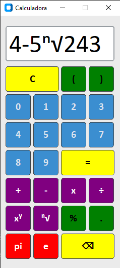

<!-- PT Section -->
<h1>
    
    Calculadora com interface gráfica em Python
</h1>

    
    

---

## Sobre o projeto

Este projeto consiste no desenvolvimento de uma calculadora com interface gráfica utilizando **Python** e **CustomTkinter**.  
A aplicação permite realizar operações matemáticas básicas através de uma interface moderna, organizada e intuitiva.

---

## Preview

    

---

## Funcionalidades

- Adição
- Subtração
- Multiplicação
- Divisão
- Potenciação
- Radiciação
- Limpeza da zona de cálculos e resultados
- Tratamento de exceções

---

## Tecnologias utilizadas

- Python 3.x
- customtkinter
- simpleeval
- math
- re
- tkinter
- winsound

---

## Como correr a aplicação

1. Clona o repositório:
git clone https://www.github.com/LJPF7/Calculadora-Python

2. Instala as dependências:
pip install -r requirements.txt

3. Corra o ficheiro:
python calculadora.py

---

## Conceitos aplicados

- Programação orientada a eventos
- Criação e reutilização de funções
- Tratamento de exceções
- Manipulação de interface gráfica
- Organização modular do código

---

## Próximas melhorias

- Implementar novas operações
- Adicionar suporte para operações avançadas na raiz.
- Criar executável (.exe)

---

## Autor

Nome do autor
Linkedin: https://www.linkedin/in/ljpf7
GitHub: https://www.github.com/LJPF7/Calculadora-Python

---

<!-- EN Section -->
<h1>
    
    Calculator with graphical interface in Python
</h1>

    
    

---

## About the project

This project involves the development of a calculator with a graphical interface using **Python** and **CustomTKinter**.
The application performs basic mathematical operations through a modern, organised and intuitive interface.

---

## Preview

    

---

## Functionalities

- Addition
- Subtraction
- Multiplication
- Division
- Potentiation
- Root extraction
- Clear the calculation and result area
- Error handling

---

## Technologies used

- Python 3.x
- customtkinter
- simpleeval
- math
- re
- tkinter
- winsound

---

## How to run

1. Clone the repository:
git clone https://www.github.com/LJPF7/Calculadora-Python

2. Install the dependencies:
pip install -r requirements.txt

3. Run the main file:
python calculadora.py

---

## Applied concepts

- Event-driven programming
- Creation and reuse of functions
- Exception handling
- Graphical interface manipulation
- Modular code organization

---

## Upcoming improvements

- Implementation of new operations
- Add support for advanced root operations
- Create an executable (.exe)

---

## Author

Author's name
Linkedin: https://www.linkedin/in/ljpf7
GitHub: https://www.github.com/LJPF7/Calculadora-Python